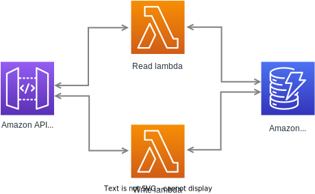

# laa-crime-apply-prototype-api

A prototype API that supports storage of applications for criminal legal aid.

The API is powered by Amazon API Gateway, AWS Lambda and Amazon DynamoDB. Involved resources are defined and provisioned using AWS SAM.



## Components

* API - see `/dist/openapi.json` for the API spec, test from [Swagger UI](https://crime-apply-api.s3.eu-west-2.amazonaws.com/index.html).
* Lambda functions - see `/aws/lambda` for read and write handlers.

## Local development

You can run and test the application locally using [AWS SAM](https://docs.aws.amazon.com/serverless-application-model/latest/developerguide/what-is-sam.html).

#### Pre-requisites:
* Node.js 12 or above
* npm 6 or above
* Docker
* AWS CLI and AWS SAM CLI

#### Setup Docker:
  * Create a network
    ```sh
    docker network create my-network
    ```
  * Run a dynamodb container in it
    ```sh
    docker run -d --network my-network -v "$PWD":/dynamodb_local_db -p 8000:8000 \
    --network-alias=dynamodb --name dynamodb \
    amazon/dynamodb-local -jar DynamoDBLocal.jar -sharedDb
    ```
#### Setup database:
  * Create table
    ```sh
    aws dynamodb create-table --cli-input-yaml file://./aws/local-dynamo.yml --endpoint-url http://localhost:8000
    ```
  * Verify table created
    ```sh
    aws dynamodb list-tables --endpoint-url http://localhost:8000
    aws dynamodb describe-table --table-name applications-for-criminal-legal-aid-dev --endpoint-url http://localhost:8000
    ```
  * Seed table with test items
    ```sh
    sam local invoke WriteCrimeApplications -e aws/events/dynamo-seed-applications.json --docker-network my-network
    ```
  * Confirm items created
    ```sh
    sam local invoke ReadCrimeApplications -e aws/events/api-fetch-applications.json --docker-network my-network
    ```

## Testing locally

You can either invoke lambda functions directly using test events, or start a local instance of the API to test request/response functionality.

a) Invoking Lambda functions directly
* You can test each lambda with dummy [events](https://docs.aws.amazon.com/lambda/latest/dg/gettingstarted-concepts.html#gettingstarted-concepts-event):
* Write lambda example:
  ```sh
  sam local invoke WriteCrimeApplications -e aws/events/api-submit-application.json --docker-network my-network
  ```
* Read lambda example:
  ```sh
  sam local invoke ReadCrimeApplications -e aws/events/api-fetch-applications.json --docker-network my-network
  ```
* Set the test event data using the `-e` flag and use `-d 5858` to run in [debug mode](https://docs.aws.amazon.com/serverless-application-model/latest/developerguide/serverless-sam-cli-using-debugging.html).

b) Making API requests
* Start a local instance of API gateway
  ```sh
  sam local start-api --docker-network my-network
  ```
* Call the API at `http://127.0.0.1:3000/applications`


## Deployment
* `staging` - updates are auto-deployed to `staging` environment on push/merge to `main` branch. See `./github/workflows`.
* `dev` - you can deploy manually using SAM cli
   * Package your lambda functions and store them in S3.
     ```sh
     sam package --s3-bucket crime-apply-api-dynamo-lambda --s3-prefix sam --output-template-file out.yml
     ```
   * Deploy a new version of your app using the artifacts the command above just generated (using dev as the stage, for example)
     ```sh
     sam deploy --template-file out.yml --capabilities CAPABILITY_IAM --guided --stack-name crime-applications-dev --parameter-overrides Stage=dev
     ```
   * Follow the promtps, using the default vales (for dev deploy) and entering the version numbers of the lambda code (versions are set in `aws/lambda/[name-of-lambda]/package.json`).

See `template.yml` for the SAM template.
